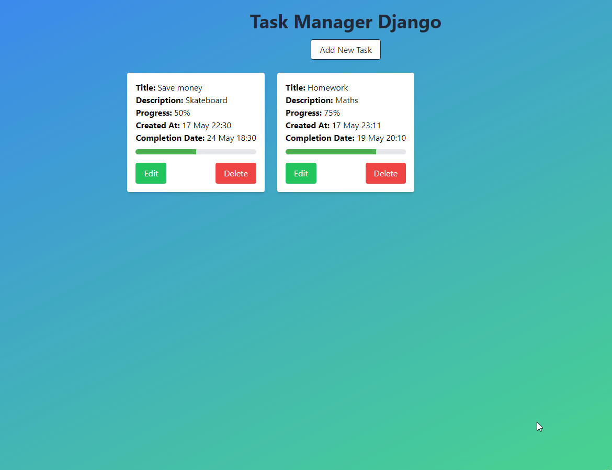

# ToDoAppDjango

A simple task manager web application built with Django and Tailwind CSS.



## Features

- Add, edit, and delete tasks
- Track progress with a visual progress bar
- Set completion date and time for each task
- Responsive and modern UI using Tailwind CSS
- Animated task cards and interactive forms

## Setup

1. **Clone the repository**

   ```
   git clone <repo-url>
   cd ToDoAppDjango
   ```

2. **Create and activate a virtual environment**

   ```
   python -m venv venv
   # On Windows:
   venv\Scripts\activate
   # On macOS/Linux:
   source venv/bin/activate
   ```

3. **Install dependencies**

   ```
   pip install django
   ```

4. **Apply migrations**

   ```
   python manage.py migrate
   ```

5. **Run the development server**

   ```
   python manage.py runserver
   ```

6. **Open your browser**

   Go to [http://127.0.0.1:8000/](http://127.0.0.1:8000/)

## Running Tests

```
python manage.py test
```

## Project Structure

- `tasks/` - Main Django app (models, views, templates)
- `templates/tasks/` - HTML templates
- `static/` - Static files (if needed)
- `manage.py` - Django management script

## Notes

- The UI uses [Tailwind CSS](https://tailwindcss.com/) via CDN.
- For production, set `DEBUG = False` and configure `ALLOWED_HOSTS`.
- You can customize the background gradient in the template files.

---
